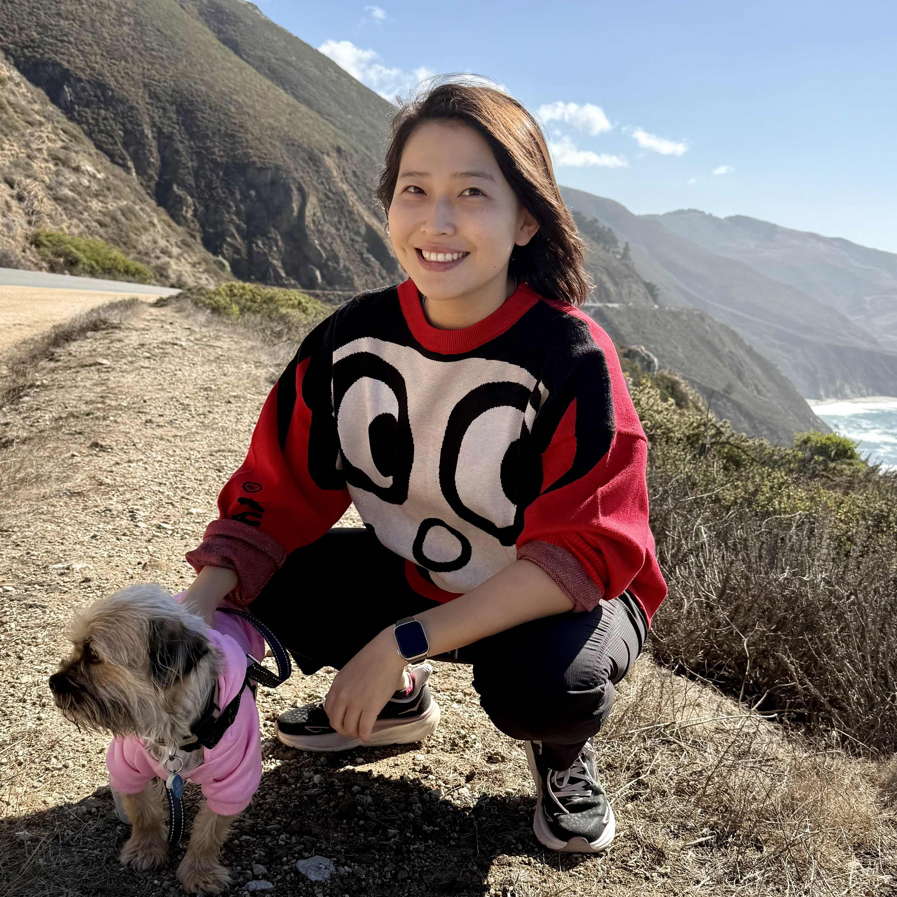

<!-- Postdoc  
[Department of Electrical and Computer Engineering](https://www.ece.ucr.edu/)  
[University of California, Riverside](https://www.ucr.edu/) -->

## Yidi Wang
Assistant Professor  
[Department of Computer Science and Engineering](https://www.scu.edu/engineering/academic-programs/department-of-computer-engineering/)  
[Santa Clara University](https://www.scu.edu/)

<!--Office:  -->
Office: Bergin 209  
Work Phone: 408-551-3818  
Email: ywang49 AT scu DOT edu  
[[Google Scholar](https://scholar.google.com/citations?user=RxiBuAgAAAAJ&hl=en) | [ORCID](https://orcid.org/0000-0003-3334-4662) | [LinkedIn](https://www.linkedin.com/in/yidi-wang-315649119/)]

<!--    -->

---

## About Me
I am an an Assistant Professor in [Department of Computer Science and Engineering](https://www.scu.edu/engineering/academic-programs/department-of-computer-engineering/) at [Santa Clara University](https://www.scu.edu/). I received my Ph.D. in the Department of Electrical and Computer Engineering from University of California, Riverside in 2023.  
During my time at UCR, I have several publications in premier conference in the field of real-time systems, with focus on real-time scheduling for GPU-accelerated applications. My primary research interests are in the field of real-time embedded and cyber-physical systems. 

Feel free to reach out to me for research discussions or potential collaborations — I am always open to new ideas and partnerships!

## Prospective Students
I am looking for a PhD student highly interested in systems research, starting at Fall 2026 (
Please note that a Master's degree is a prerequisite for admission to the PhD program in the department). I am also looking for multiple Master's, undergraduate students to work with me.

If you are interested, 
+ For external students: 
Please drop me an email with title <u>"Prospective PhD/MS/UG Student - Your name"</u>, and attach your CV and transcripts. The emails without this title format will be ignored.
+ For SCU students: If you are an SCU student, please drop me an email using your **scu email** with title <u>"Potential PhD/MS/UG Student - Your name - SCU"</u>, and attach your CV and transcripts. The emails without this title format will be ignored.

[Link to SCU Computer Science and Engineering Graduate Programs](https://www.scu.edu/engineering/academic-programs/department-of-computer-engineering/graduate/)

## News
- Oct 2025: Two WiP papers with students as the first author are accepted to RTSS@BP 2025.
- Oct 2025: I am serving on the TPC for RTSS@BP 2025.
- May 2025: I am serving on the TPC for RTSS 2025.
- Sept 2024: I am serving on the TPC for RTSS@BP 2024.
- Sept 2024: Started to work as an assistant professor at SCU!
- May 2024: One paper will appear at [ECRTS 2024](https://www.ecrts.org/). This work provides a solution with minimal userspace code modification to enable GPU preemption, and it is also the first one to provide a response time analysis for the default GPU scheduling approach. Check it out: [[ECRTS24](../files/2024/ecrts24_gcaps_paper.pdf)].
- Mar 2024: I will be joining Santa Clara University as a Tenure-Track Assistant Professor in CSE starting in Fall 2024!
- Feb 2024: I am serving on the TPC for [RTAS@BP 2024](https://2024.rtas.org/call-for-papers-the-brief-presentations-track/).
- Aug 2023: Started to work as a Postdoc at UCR.
- Jun 2023: I completed all requirements for the degree of Doctor of Philosophy in the field of Electrical Engineering at UCR.
<!-- * Apr 2024: One first-authored paper is accepted to [ECRTS 2024](https://www.ecrts.org/). -->