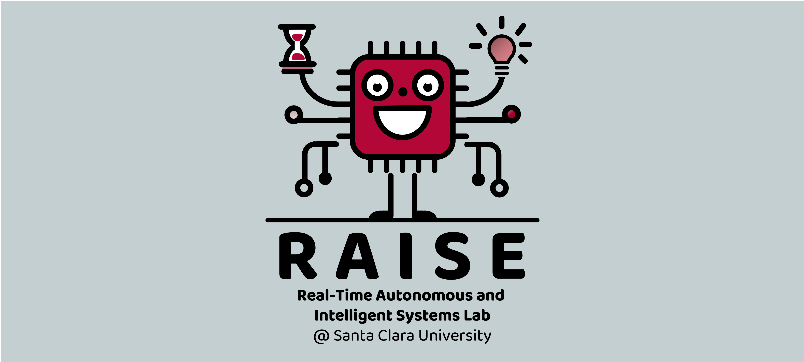



---

## Research Interests

My core objective is to advance the design of responsive, predictable, and verifiable computing systems for tasks with dynamic timing constraints especially in resource limited environments.

For my research style, it spans from system implementation, including developing novel scheduling algorithms in practical systems across the whole software stack, to theoretical analysis including formulating mathematical models for system analysis.

So far, my research has mainly focused on addressing the challenges of integrating GPUs in real-time scheduling where tasks have stringent timing requirements. They covers several aspects: (i) non-deterministic GPU behaviors, (ii) underutilized computing resources, (iii) scheduling for tasks having varied arrival patterns with constrained deadlines, and (iv) power management in GPU platforms [[ISLPED25](../files/2025/islped25_eclip_paper.pdf), [ECRTS24](../files/2024/ecrts24_gcaps_paper.pdf), [Preprint24a](https://arxiv.org/abs/2401.16529), [RTSS22](../files/2022/RTSS22_sBEET-mg.pdf), [RTSS22@Work](../files/2022/RTSSWork22_paper.pdf), [RTSS21](../files/2021/RTSS21_sBEET.pdf), [RTSS19-Wip](../files/2019/rtss19wip-gpu)].

Besides, I also work on ensuring the reliable system operation on intermittently-powered batteryless devices [[Preprint24b](https://arxiv.org/abs/2311.07227), [RTCSA22](../files/2022/RTCSA22_AoI.pdf), [IoTJ21](../files/2021/iotj2021-ipd.pdf)], and reliable system support for intelligent applications [[RTSS21b](../files/2021/RTSS21_AegisDNN.pdf)].

Built upon these, currently my research interests include:
* System software support for heterogeneous platforms
* ML-based scheduler design

## Students
* Haopeng Gao (MS; W25 - Present)
* Yinmingren Fu (MS; W25 - Present)
* Dhruv Patel (UG; W25 - Present)